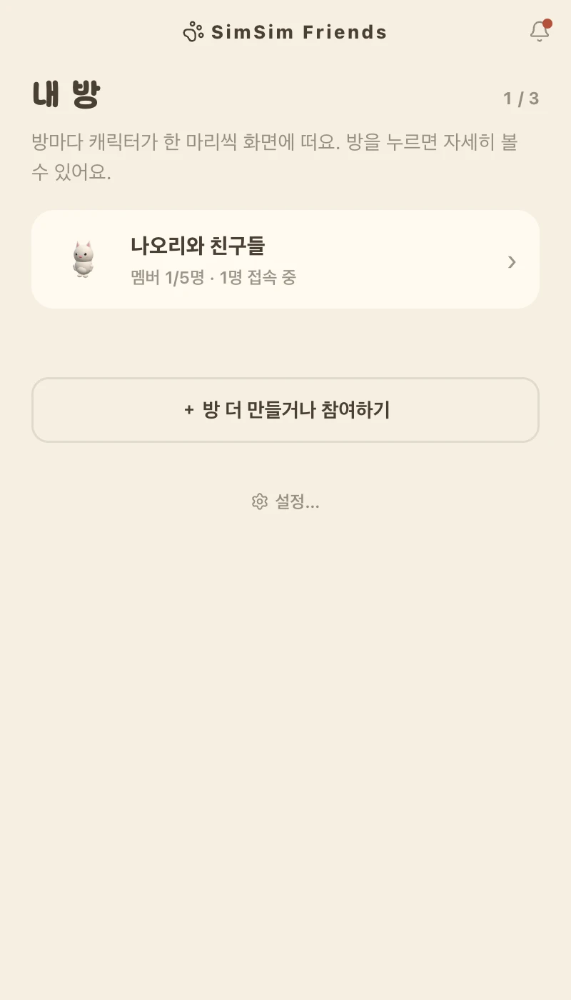

<div align="center">


# SimSim Friends

**바탕화면 위에 작은 친구 한 마리.**
내 캐릭터를 누르면 상대 화면에서 캐릭터가 춤을 춰요.

무료 · 가입 없음 · macOS · Windows · Linux

[**받으러 가기**](https://simsim-friends.vercel.app/) · [English](https://simsim-friends.vercel.app/en/)

</div>

---

## 무엇을 하는 앱인가요

말을 걸기에는 시시하고, 안 걸자니 아쉬운 순간이 있어요. "뭐 해?" 라고 보내면 상대가
답해야 할 것 같아 부담이 되고, 그렇다고 이모지 하나만 보내기도 뻘쭘하고요.

SimSim Friends는 그 사이를 채웁니다. 내가 내 캐릭터를 톡 누르면, 멀리 있는 친구의 바탕화면
구석에서 캐릭터가 잠깐 춤을 춰요. **받은 쪽은 아무것도 하지 않아도 됩니다.** 읽음
표시도, 답장해야 할 말풍선도 없어요. 그냥 뭔가 잠깐 움직였고 그게 나였다는 것만
전해집니다.

메신저를 하나 더 만드는 앱이 아니에요. **답을 요구하지 않는 것**이 이 앱의 전부입니다.

<div align="center">

</div>

---

## 받기

내 컴퓨터에 맞는 파일 하나만 받으면 됩니다. 설치할 때 관리자 권한은 묻지 않아요.

| | 어떤 파일인가요 |
|---|---|
| **macOS — 요즘 맥** | 2020년 후반 이후에 나온 맥이에요 |
| **macOS — 그 이전 맥** | 2020년 중반 이전에 산 맥이에요 |
| **Windows** | 두 번 눌러서 설치하는 파일이에요 |
| **Linux** | 받아서 바로 여는 파일 하나예요 (x86_64) |

어느 쪽인지 모르겠다면 왼쪽 위 사과 메뉴에서 **이 Mac에 관하여**를 열어 보세요.
"칩" 이라고 적혀 있으면 요즘 맥, "프로세서" 라고 적혀 있으면 그 이전 맥이에요.

받는 곳은 두 군데인데 내용은 같습니다.

- [SimSim Friends 홈페이지](https://simsim-friends.vercel.app/#download) — 내 컴퓨터에 맞는
  파일을 알아서 골라 줍니다
- [GitHub 릴리스](https://github.com/hayoung-99/simsim-friends/releases) — 지난 버전까지 전부

### 처음 한 번만

처음 열 때 컴퓨터가 "이거 열어도 되나요?" 하고 한 번 물어봐요. 만든 사람을 확인해 주는
서명(코드 서명)을 아직 붙이지 않아서 그렇습니다. 아래대로 하면 **다음부터는 그냥
열립니다.**

**macOS**

1. 받은 앱을 **응용 프로그램** 폴더로 옮겨요.
2. 두 번 눌러 열고, 경고가 뜨면 **완료**를 눌러요.
3. **시스템 설정 → 개인 정보 보호 및 보안**을 열고, 아래쪽 **확인 없이 열기**를 눌러요.
4. 한 번 더 **열기**를 누르면 끝이에요.

**Windows**

1. 받은 파일을 두 번 눌러요.
2. 파란 창이 뜨면 **추가 정보**를 눌러요.
3. 아래에 나타나는 **실행**을 누르면 설치가 이어져요.

**Linux**

1. 받은 파일을 마우스 오른쪽으로 눌러 **속성 → 권한**에서 **"프로그램으로 실행
   허용"**을 켜요 (터미널이 편하면 `chmod +x simsim-friends-{version}-x86_64.AppImage`).
2. 두 번 눌러 열어요.

받은 파일은 홈 폴더나 다운로드 폴더처럼 **내가 지울 수 있는 자리에 그대로
두세요.** 압축을 풀거나 `/opt` 처럼 손댈 수 없는 자리에 두면 새 버전을 조용히
받아 두지 못하고 "새 버전이 나왔어요" 안내만 떠요.

> 같은 안내가 [홈페이지](https://simsim-friends.vercel.app/#install)에도 그림과 함께
> 있습니다. 둘 중 편한 쪽을 보세요.

> **Linux 는 아직 갓 나왔어요.** 파일은 정상으로 만들어지지만, 캐릭터가
> 바탕화면 위에 제대로 뜨는지는 아직 확인하지 못했습니다. 이상하면 알려 주세요.

---

## 시작하기

앱을 켜면 캐릭터와 함께 이런 창이 열려요.

<div align="center">

</div>

1. **이름을 정해요.** 방에서 다른 사람들에게 보일 이름이에요.
2. **방을 만들어요.** 여섯 글자짜리 초대코드가 나옵니다.
3. **그 코드를 친구에게 알려 주세요.** 상대가 앱을 받아 코드를 넣으면 그때부터 서로
   찌를 수 있어요.

이미 만들어진 방에 들어가는 것이라면 2번 대신 **초대코드로 참여하기**에 코드를 넣으면
됩니다. 초대코드는 **24시간**만 살아 있고, 방 안에서 언제든 새로 발급할 수 있어요.

> **한 명만 불러 오면 시작돼요.** 캐릭터는 방마다 한 마리씩 뜨기 때문에 방이 하나는
> 있어야 하고, 혼자 만든 방도 방이라 캐릭터는 그대로 살아 있어요. 콕 찌를 상대가
> 아직 없을 뿐이에요.

방은 **최대 3개**까지 만들거나 참여할 수 있고, 한 방에는 **최대 5명**이 들어갑니다.
방마다 캐릭터를 다른 동물로 골라 두면 어느 방에서 온 신호인지 한눈에 보여요.

---

## 이렇게 씁니다

| 이렇게 하면 | 이런 일이 생겨요 |
|---|---|
| **캐릭터를 클릭** | 내 캐릭터는 움찔하고, **그 방 사람들** 화면에서 캐릭터가 춤을 춰요 |
| **캐릭터를 끌기** | 원하는 자리로 옮겨져요. 다음에 켜도 그 자리에 있어요 |
| **캐릭터에 우클릭** | 이 방 자세히 보기 · 방 목록 · 크기 조절 · 캐릭터 모두 숨기기 · 종료 |
| **크기 조절** | 슬라이더로 25%~200% 사이에서 정해요. 발밑이 붙박여 있어 제자리에서 커져요 |
| **메뉴 막대 아이콘** | 방 상태를 보거나, 캐릭터를 한 번에 숨기고 다시 꺼내요 |
| **방 창의 `콕!` 버튼** | 방 전체가 아니라 **그 사람 한 명만** 콕 찔러요 |

캐릭터 옆 빈 자리는 **클릭이 그대로 바탕화면으로 통과**해요. 아이콘을 가리지 않습니다.

### 화면을 보면 무슨 일인지 알 수 있어요

| 보이는 것 | 뜻 |
|---|---|
| 좌우로 흔들며 춤추고 음표가 떠올라요 | 그 방 누군가 나를 콕 찔렀어요 (발밑 이름표에 누구인지) |
| 움찔하며 `콕콕!` 말풍선이 떠요 | 내가 내 캐릭터를 눌렀어요 |
| 둘이 한꺼번에 | 같은 순간에 일어났어요 |

겹치지 않게 자리를 셋으로 나눠 뒀어요 — **머리 위**는 내가 눌렀을 때의 말풍선,
**좌우**는 춤출 때 떠오르는 음표, **발밑**은 누가 찔렀는지.

여러 명이 동시에 찔러도 **춤은 한 번**이에요. 대신 **이름표는 찌른 사람마다** 하나씩
발밑에 나란히 붙습니다.

캐릭터 종류·크기·자리는 **방마다 따로 저장되고 내 화면에만 적용되는 내 설정**이에요.
내가 고양이를 골랐다고 상대 화면의 캐릭터가 바뀌지는 않습니다.

---

## 배터리는 얼마나 쓰나요

컴퓨터를 켠 순간부터 끌 때까지 떠 있는 앱이라, **아무 일도 없을 때 얼마나 게으르게
구는가**가 곧 배터리와 팬 소리를 정합니다. 메뉴 막대 ▸ 설정에서 세 단계 중 고르세요.

| 단계 | 가만히 있을 때 | 찔렸을 때 | 캐릭터 3마리 기준 |
|---|---|---|---|
| 부드럽게 | 화면 주사율 그대로 | 그대로 | 약 9% |
| **균형** (기본) | 초당 30프레임 · 그림자 고정 | 초당 60프레임 | 약 5% |
| 절약 | 초당 10프레임 · 해상도 절반 | 초당 60프레임 | 약 3% |

어느 단계에서든 호흡·눈 깜빡임·귀 쫑긋·꼬리는 그대로 살아 있고, 누가 찌르면 곧바로
넉넉한 프레임으로 올라가요. 그리고 단계와 상관없이 **캐릭터를 숨기거나 컴퓨터가
잠들면 아예 그리지 않습니다** (0%).

숫자는 M 시리즈 맥에서 잰 값이에요.

---

## 여러 나라 말

한국어 · English · 日本語 · 中文 을 지원합니다. 처음 켜면 **컴퓨터가 쓰는 말을
따라가고**, 설정 창에서 직접 고를 수도 있어요. 바꾸면 메뉴 막대와 우클릭 메뉴까지
함께 바뀝니다.

말은 사람마다 따로예요. 내가 한국어로 쓰고 있어도 상대는 자기가 고른 말로 봅니다.

> 영어판만 '방' 대신 team, '멤버' 대신 teammate 라고 불러요. `room` 을 그대로 옮기면
> 사람을 가리키는 말(`roommate`)이 아예 다른 뜻이 되어서, 자연스러운 쪽을 택했습니다.

---

## 무엇이 오가나요

- **오가는 것은 "누가 눌렀다" 는 신호와 이름뿐이에요.** 화면에 뭐가 떠 있는지도,
  파일도 밖으로 나가지 않습니다.
- **가입이 없어요.** 이메일도 비밀번호도 받지 않습니다.
- **소리가 나지 않아요.** 알림음도 뱃지도 없습니다.
- **방을 나가면 그 즉시 끊깁니다.** 방에 있던 사람이 모두 나가면 그 방과 초대코드는
  사라져요.
- **만드는 코드를 전부 공개해 뒀습니다.** 미덥지 않으면 직접 읽어 보셔도 돼요.

---

## 궁금할 만한 것

**정말 무료인가요?**
네. 광고도 유료 기능도 없어요.

**친구도 앱을 받아야 하나요?**
네. 서로의 바탕화면에 캐릭터가 있어야 신호가 오갑니다. 한 사람이 방을 만들어 여섯
글자 코드를 알려 주면, 나머지는 그 코드만 넣으면 돼요.

**회사 컴퓨터에 깔아도 될까요?**
설치할 때 관리자 권한을 묻지 않고, 밖으로 나가는 것은 신호와 이름뿐이에요. 다만
회사마다 규칙이 다르니 그건 확인해 보세요.

**캐릭터를 잠깐 치우고 싶어요.**
메뉴 막대 아이콘이나 캐릭터 우클릭에서 **캐릭터 모두 숨기기**를 누르면 돼요. 다시
꺼낼 때까지 그리지 않으니 배터리도 쓰지 않습니다.

**초대코드가 만료됐대요.**
코드는 24시간만 살아 있어요. 그 방에 있는 사람에게 새 코드를 받아 주세요.

**앱을 다시 깔았더니 방이 사라졌어요.**
계정 대신 기기에 저장해 둔 정보로 누구인지 가리기 때문에, 그 정보를 잃으면 방과도
남남이 됩니다. 초대코드로 다시 들어오면 돼요.

**새 버전은 어떻게 받나요?**
Windows 와 Linux 는 조용히 받아 뒀다가 알려 줍니다(Linux 는 받은 파일을 지울 수
있는 자리에 그대로 두었을 때만이에요). macOS 는 코드 서명이 없어서 자동 업데이트가
안 되기 때문에 "새 버전이 나왔어요" 안내만 띄워요. 그때 다시 받으시면 됩니다.

---

## 직접 만들어 보려면

Node 는 `.nvmrc` 에 적힌 버전을 씁니다. 실시간 전달과 방 정보 저장에 Supabase 무료
플랜을 쓰기 때문에, 프로젝트를 하나 만들어 접속 정보를 넣어야 해요 —
[docs/SUPABASE_SETUP.md](docs/SUPABASE_SETUP.md) 에 순서가 있습니다.

```bash
nvm use
npm ci
npm start   # 빌드하고 앱을 띄웁니다
```

접속 정보가 없어도 앱은 켜지고, 무엇을 해야 하는지 창이 안내해 줍니다. 화면만
둘러보려면 `SIMSIM_FAKE_NET=1 npm start` 로 가짜 서버를 쓸 수도 있어요.

자주 쓰는 것들.

```bash
npm test           # 단위 테스트 (Supabase 없이 돕니다)
npm run typecheck  # 타입 검사
npm run lint       # 린트
npm run build      # 화면·preload·메인 빌드
npm run start:both # 한 대에서 두 사람인 척 동시에 띄우기
```

구조를 한 줄로 적으면, `apps/desktop` 이 Electron 앱이고 `apps/web` 이 홈페이지,
`packages/shared` 가 둘이 함께 보는 것, `supabase/schema.sql` 이 데이터베이스입니다.

---

## 라이선스

[MIT](LICENSE). 자유롭게 쓰고 고치셔도 됩니다.
